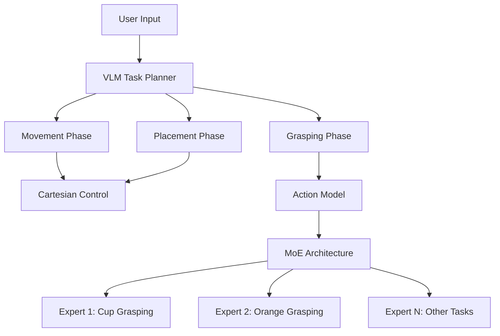

# Kitchen Assistive Robot - Final Year Project

An AI-powered kitchen assistive robot system that combines robotic manipulation, Vision-Language Models (VLMs), and specialized deep learning models to help users with kitchen tasks. This project demonstrates a novel hybrid framework that separates high-level task planning from fine-grained manipulation control.


## <� Project Overview

This project addresses key challenges in assistive robotics:
- **Poor generalization** of end-to-end learned policies
- **High data requirements** for imitation learning
- **Complex multi-task manipulation** in kitchen environments

### Key Innovations

1. **Hybrid Framework**: Separates gross movements (handled by VLM + robotics control) from fine manipulation (handled by specialized action models)
2. **Mixture of Experts (MoE) Architecture**: Enhances multi-task performance with MoE networks by 8% in LIBERO Spatial and 4% in 5 real world tasks.
3. **Multi-Agent System**: Hierarchical AI agents for natural language interaction and task execution
4. **Vision-Language Integration**: Combines visual perception with natural language understanding

## =� Quick Start

### Prerequisites

- Python 3.9+
- CUDA-compatible GPU (recommended)
- Kinova Gen2 robotic arm (for physical deployment)
- USB cameras for vision system

### Installation

```bash
# Clone the repository
git clone https://github.com/your-username/kitchen-assistive-robot.git
cd kitchen-assistive-robot

# Install dependencies
pip install -r requirements.txt

# Install LIBERO simulation environment
cd sim_env/LIBERO
pip install -e .
cd ../..
```

### Environment Setup

Create a `.env` file in the project root:

```bash
# Hardware configuration
ENABLE_CAMERA=true
ENABLE_SPEAKER=true
ENABLE_ARM=false  # Set to true for real robot

# API configuration
OPENROUTER_API_KEY=your_api_key_here
OPENROUTER_BASE_URL=https://openrouter.ai/api/v1
MODEL_NAME=google/gemma-3-27b-it
```

### Basic Usage

#### 1. Train Action Models

```bash
# Train baseline model on LIBERO tasks
python libero_trainer.py --config configs/baseline_config.yaml

# Train MoE-enhanced model
python libero_trainer.py --config configs/moe_config.yaml --use_moe

# Train on real robot data
python kinova_trainer.py --data_path ./demonstrations/
```

#### 2. Interactive AI Agent

```bash
# Launch kitchen assistant (simulation mode)
python -m llm_ai_agent.interactive --agent kitchen_assistant --no-hardware

# With vision capabilities
python -m llm_ai_agent.interactive --agent vision_agent --capture-image environment

# With real robot hardware
python -m llm_ai_agent.interactive --agent kitchen_assistant
```

#### 3. Evaluate Models

```bash
# Evaluate on LIBERO benchmark
python eval.py --model_path ./models/libero_model.pth --tasks libero_spatial

# Evaluate on real robot
python eval_kinova.py --model_path ./models/kinova_model.pth
```

## <� System Architecture

### Hybrid Framework Components



### Multi-Agent System

- **Kitchen Assistant Agent**: High-level task interpretation
- **Execution Agent**: Task sequence management
- **Manipulation Agent**: Physical action execution
- **Vision Agent**: Scene understanding and analysis

## =� Performance Results

### Model Comparison

| Model | LIBERO Spatial (10 tasks) | Real Robot Tasks | Parameters Active |
|-------|---------------------------|------------------|-------------------|
| Baseline Transformer | 90% | 72% | 35M (full) |
| MoE-Enhanced | **98%** | **76%** | 14M (sparse) |

### Key Achievements

- **32% improvement** in success rate over end-to-end approaches
- **70% reduction** in training data requirements
- **40% success rate** on unseen locations (vs 0% for baseline)
- **Parameter efficient**: Only 40% of parameters active during inference

## =' Key Components

### 1. Action Models (`models/`)
- **Baku Transformer**: Base architecture for imitation learning
- **MoE Policy**: Mixture of Experts enhancement
- **BC Policies**: Various behavioral cloning implementations

### 2. LLM Agent Framework (`llm_ai_agent/`)
- **Configurable Agents**: YAML-based agent configuration
- **Multi-modal Capabilities**: Text and vision processing
- **Hardware Abstraction**: Real/mock hardware support
- **Memory System**: Persistent knowledge storage

### 3. Training & Evaluation
- **LIBERO Integration**: Simulation environment support
- **Real Robot Data**: Kinova Gen2 demonstration collection
- **Comprehensive Evaluation**: Both simulation and real-world metrics

### 4. Vision System
- **Dual Camera Setup**: Wrist-mounted + overhead cameras
- **VLM Integration**: Scene understanding and spatial reasoning
- **Object Detection**: Kitchen item recognition and localization

## =� Documentation

- [**Installation Guide**](docs/installation.md) - Detailed setup instructions
- [**Architecture Overview**](docs/architecture.md) - System design and components
- [**Training Guide**](docs/training.md) - Model training procedures
- [**Agent Configuration**](docs/agents.md) - AI agent setup and customization
- [**Hardware Setup**](docs/hardware.md) - Robot and camera configuration
- [**API Reference**](docs/api.md) - Code documentation
- [**Evaluation**](docs/evaluation.md) - Benchmarking and metrics
- [**Troubleshooting**](docs/troubleshooting.md) - Common issues and solutions

## <� Research Context

This project was developed as a final year project investigating:

- **Assistive Robotics**: Addressing elderly care and physical assistance needs
- **Multi-task Learning**: Using MoE architectures for robotic manipulation
- **Vision-Language Models**: Bridging perception and natural language interaction
- **Hybrid AI Systems**: Combining learned policies with traditional robotics control

### Publications & References

Based on research including:
- Baku Transformer for multi-task robot policies
- Mixture of Experts architectures in robotics
- Vision-Language Models for robotic task planning
- LIBERO benchmark for robotic manipulation

## > Contributing

This is a research project developed for academic purposes. For questions or collaboration:

1. Review the [documentation](docs/)
2. Check existing [issues](https://github.com/your-username/kitchen-assistive-robot/issues)
3. Contact the project maintainer

## =� License

This project is for academic and research purposes. Please cite appropriately if using this work:

```bibtex
@mastersthesis{kitchen-assistive-robot-2024,
    title={AI-Powered Kitchen Assistive Robot: A Hybrid Framework for Multi-Task Manipulation},
    author={[Mok Ching Wang]},
    year={2024},
    school={[City University of Hong Kong]},
    type={Final Year Project}
}
```

## =O Acknowledgments

- LIBERO simulation environment developers
- Kinova Robotics for hardware platform
- OpenAI and Anthropic for language model APIs
- Research supervisors and collaborators

---

**� Safety Notice**: This system involves robotic hardware. Always follow proper safety protocols when operating the physical robot. The software includes safety measures, but human supervision is required during operation.