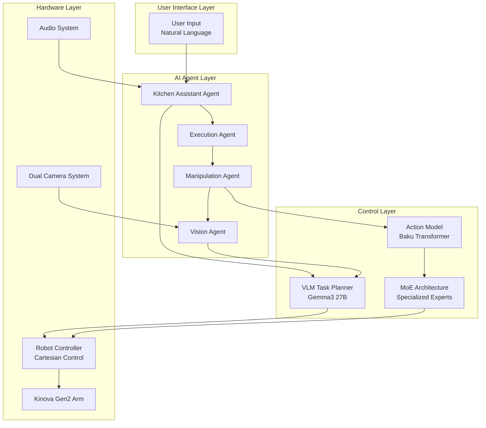
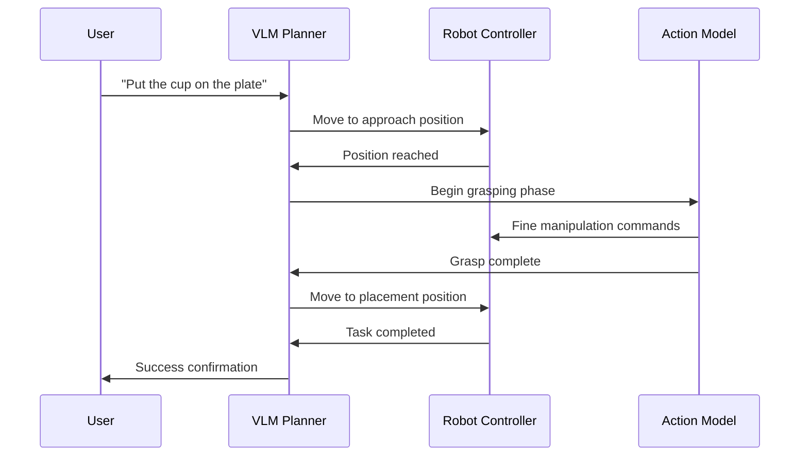
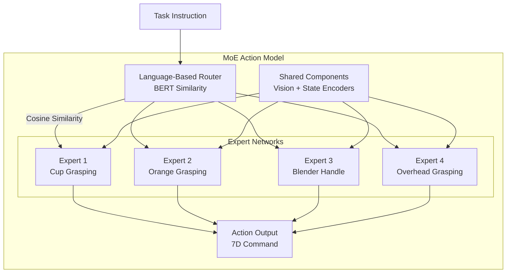
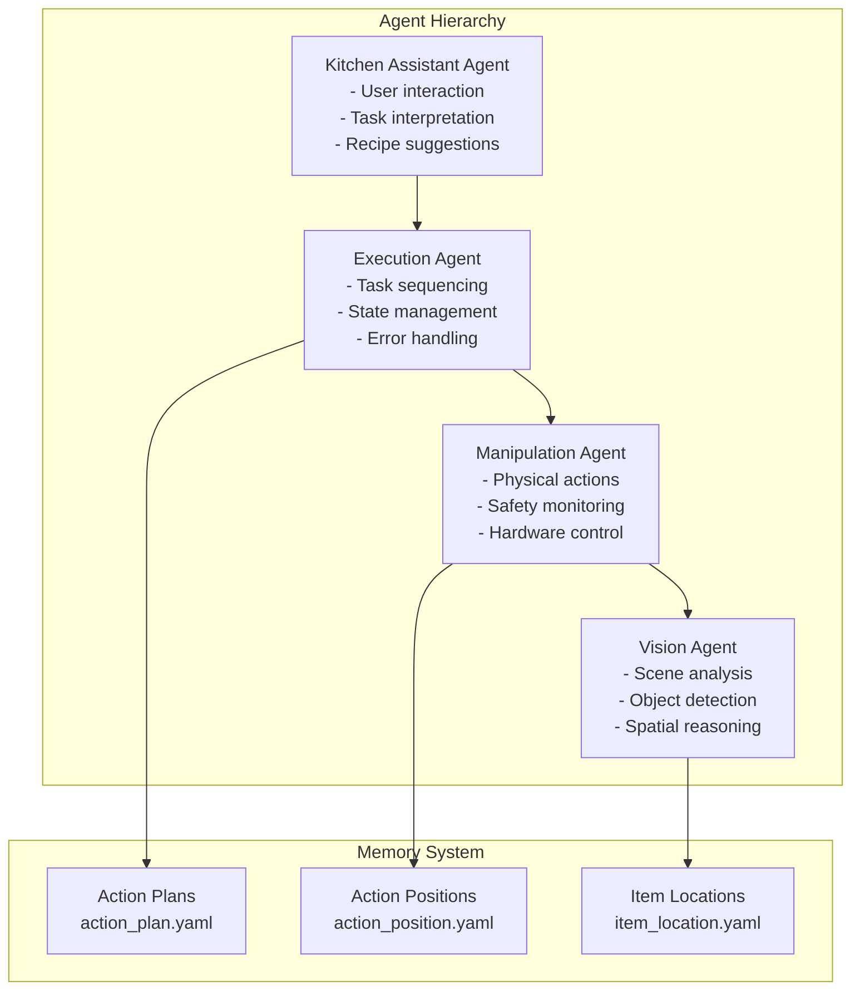
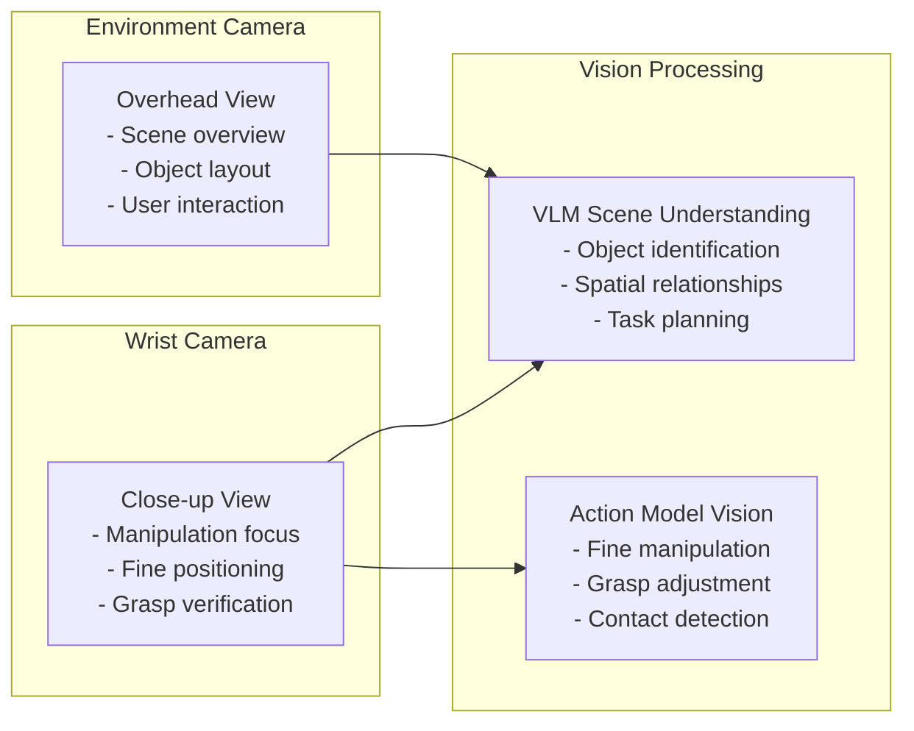

# System Architecture

This document provides a comprehensive overview of the Kitchen Assistive Robot system architecture, including the hybrid framework, multi-agent system, and key components.

## High-Level System Overview

The Kitchen Assistive Robot system is built on a **hybrid architecture** that combines the strengths of Vision-Language Models (VLMs) for high-level reasoning with specialized deep learning models for fine-grained manipulation.



## Core Components

### 1. Hybrid Framework

The system's core innovation is the **hybrid framework** that separates complex manipulation tasks into distinct phases:

#### Phase Separation Strategy



#### 1.1 Movement Phase (VLM + Robotics Control)

**Responsibilities:**
- High-level task planning and sequencing
- Gross movement between known positions
- Object placement and manipulation coordination
- Human-robot interaction and communication

**Implementation:**
- **VLM**: Gemma3 27B model for reasoning and planning
- **Tool System**: JSON-based tool calling for robot control
- **Position Management**: Pre-defined coordinates for objects and actions
- **Cartesian Control**: Direct pose commands to robot controller

**Key Tools:**
```python
tools = {
    "get_item_locations": "Retrieve stored object coordinates",
    "get_action_positions": "Get pre-defined action poses", 
    "move_position": "Send Cartesian pose commands",
    "speak": "Provide audio feedback to user"
}
```

#### 1.2 Grasping Phase (Action Model)

**Responsibilities:**
- Fine-grained manipulation control
- Visual feedback processing
- Reactive grasp adjustment
- Gripper control and force modulation

**Implementation:**
- **Base Architecture**: Baku Transformer with multi-modal inputs
- **Input Processing**: 128x128 RGB images + robot state + language instruction
- **Output**: 7D action vector (3D velocity + 3D angular velocity + gripper)
- **Training**: Imitation learning with behavioral cloning

**Model Architecture:**
```python
class ActionModel(nn.Module):
    def __init__(self):
        self.vision_encoder = ResNet(input_channels=3)
        self.language_encoder = BERTEncoder() 
        self.state_encoder = MLPEncoder(input_dim=15)
        self.transformer = TransformerDecoder()
        self.action_head = MLPHead(output_dim=7)
    
    def forward(self, images, language, robot_state):
        # Multi-modal feature fusion
        vision_features = self.vision_encoder(images)
        language_features = self.language_encoder(language)
        state_features = self.state_encoder(robot_state)
        
        # Transformer processing with action chunking
        combined_features = torch.cat([vision_features, language_features, state_features], dim=-1)
        transformer_output = self.transformer(combined_features)
        
        # Action prediction
        actions = self.action_head(transformer_output)
        return actions
```

### 2. Mixture of Experts (MoE) Architecture

The MoE enhancement addresses multi-task learning challenges by creating specialized expert networks for different manipulation tasks.

#### 2.1 Expert Specialization



#### 2.2 Routing Mechanism

**Language-Based Expert Selection:**
```python
class MoERouter:
    def __init__(self, expert_tasks):
        self.expert_embeddings = {}
        self.bert_encoder = BertModel.from_pretrained('bert-base-uncased')
        
        # Store task embeddings for each expert
        for i, task in enumerate(expert_tasks):
            embedding = self.bert_encoder.encode(task)
            self.expert_embeddings[i] = embedding
    
    def route(self, task_instruction):
        # Encode current task
        task_embedding = self.bert_encoder.encode(task_instruction)
        
        # Find most similar expert
        similarities = {}
        for expert_id, expert_embedding in self.expert_embeddings.items():
            similarity = cosine_similarity(task_embedding, expert_embedding)
            similarities[expert_id] = similarity
            
        # Select top-1 expert
        selected_expert = max(similarities, key=similarities.get)
        return selected_expert
```

**Key Advantages:**
- **Parameter Efficiency**: Only 40% of parameters active during inference
- **Task Specialization**: Each expert optimizes for specific manipulation skills
- **Scalability**: Easy to add new experts for additional tasks
- **Performance**: 8% improvement over baseline on LIBERO benchmark

### 3. Multi-Agent System

The AI agent framework provides a hierarchical structure for natural language interaction and task execution.

#### 3.1 Agent Hierarchy



#### 3.2 Configuration System

Agents are configured using YAML files for maximum flexibility:

**Agent Configuration Example:**
```yaml
# configs/agents/kitchen_assistant.yaml
agent_type: kitchen_assistant
description: A specialized agent for kitchen assistance with hardware control
version: 1.0.0
inherits_from: base_agent

system_prompt: |
  You are a helpful kitchen assistant robot. You can help users with various 
  kitchen tasks including object manipulation, recipe suggestions, and general
  cooking guidance. You have access to robotic arms, cameras, and speech
  capabilities.

tools:
  include:
    - speak
    - move_position
    - get_item_locations
    - get_action_plans
    - get_action_positions
    - capture  # Vision capabilities

memory_access: true
hardware_enabled: true
multimodal_capable: true
```

#### 3.3 Tool System

The tool system provides a unified interface for agent capabilities:

```python
# Core tool categories
TOOL_CATEGORIES = {
    "basic": ["calculator", "text_processor"],
    "hardware": ["move_position", "move_home", "speak", "capture"],
    "memory": ["get_action_plans", "get_action_positions", "get_item_locations"],
    "manipulation": ["grasp_object", "place_object", "move_to_position"],
    "information": ["analyze_recipe", "identify_objects", "spatial_reasoning"]
}
```

### 4. Vision System

The dual-camera vision system provides comprehensive environmental awareness:

#### 4.1 Camera Configuration



#### 4.2 Vision-Language Integration

**VLM Spatial Reasoning:**
- Object identification and localization
- Spatial relationship understanding
- 3D coordinate prediction (experimental)
- Scene change detection

**Action Model Vision:**
- Real-time visual feedback for grasping
- Object pose estimation
- Grasp quality assessment
- Reactive control adjustments

### 5. Data Flow Architecture

#### 5.1 Training Data Pipeline

```mermaid
graph TD
    subgraph "Data Collection"
        Demo[Human Demonstrations<br/>PS4 Controller + Teleoperation]
        Sim[LIBERO Simulation<br/>Synthetic Data]
    end
    
    subgraph "Data Processing"
        Extract[Feature Extraction<br/>- Images (128x128)<br/>- Robot states (15D)<br/>- Actions (7D)]
        Augment[Data Augmentation<br/>- Image transforms<br/>- Trajectory smoothing]
    end
    
    subgraph "Model Training"
        BC[Behavioral Cloning<br/>NLL Loss]
        MOE_Train[MoE Training<br/>Expert Specialization]
    end
    
    Demo --> Extract
    Sim --> Extract
    Extract --> Augment
    Augment --> BC
    BC --> MOE_Train
```

#### 5.2 Inference Pipeline

```mermaid
graph TD
    subgraph "Runtime Execution"
        Input[User Request<br/>"Put cup on plate"]
        Parse[VLM Task Parsing<br/>Intent Recognition]
        Plan[Action Planning<br/>Sequence Generation]
        
        subgraph "Execution Loop"
            Move[Movement Phase<br/>VLM + Robot Control]
            Grasp[Grasping Phase<br/>Action Model + MoE]
            Monitor[Visual Monitoring<br/>Success Verification]
        end
        
        Feedback[User Feedback<br/>Task Completion]
    end
    
    Input --> Parse
    Parse --> Plan
    Plan --> Move
    Move --> Grasp  
    Grasp --> Monitor
    Monitor --> Feedback
    Monitor --> Move
```

## Performance Characteristics

### Computational Requirements

| Component | Model Size | Active Parameters | Memory Usage | Inference Time |
|-----------|------------|-------------------|--------------|----------------|
| VLM (Gemma3 27B) | 27B | 27B | ~54GB | ~2-3s |
| Action Model (Baseline) | 35M | 35M | ~140MB | ~50ms |
| Action Model (MoE) | 35M | 14M | ~140MB | ~45ms |
| Vision Processing | - | - | ~500MB | ~30ms |

### Scalability Considerations

**Horizontal Scaling:**
- Multiple robot arms can share the same VLM instance
- Action models can be deployed independently per robot
- Distributed inference for high-throughput scenarios

**Task Scaling:**
- MoE architecture allows adding new experts without retraining existing ones
- Memory system supports incremental knowledge updates
- Agent configurations enable rapid deployment of new capabilities

## Security and Safety

### Safety Mechanisms

1. **Hardware Safety:**
   - Emergency stop functionality
   - Force limiting on robot controller
   - Collision detection and avoidance
   - Safe position monitoring

2. **Software Safety:**
   - Input validation for all commands
   - Bounds checking on robot movements
   - Timeout mechanisms for stuck operations
   - Graceful error handling and recovery

3. **AI Safety:**
   - Output filtering for harmful commands
   - Confidence thresholding for uncertain actions
   - Human oversight requirements for critical tasks
   - Logging and audit trails for all decisions

### Data Privacy

- No personal data stored permanently
- Local processing for sensitive operations
- Configurable external API usage
- Encrypted communication channels

This architecture provides a robust, scalable, and safety-conscious foundation for assistive kitchen robotics, balancing the flexibility of modern AI with the reliability requirements of physical robot systems.